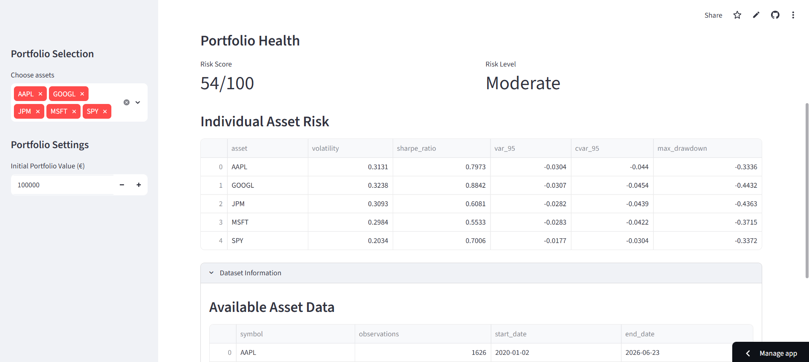
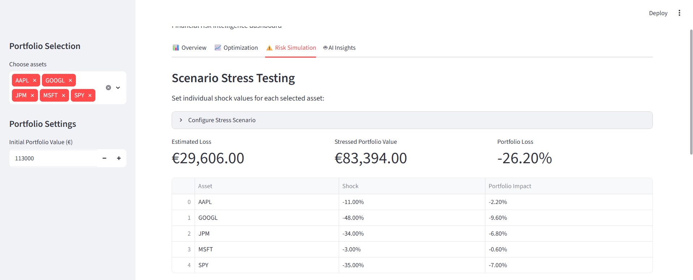
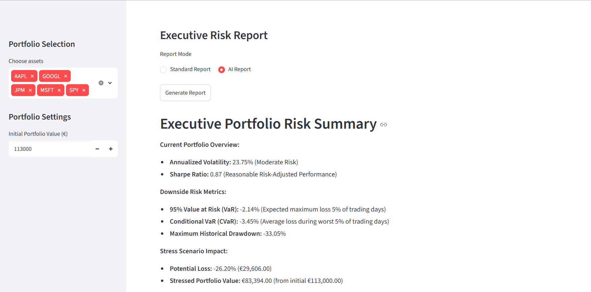
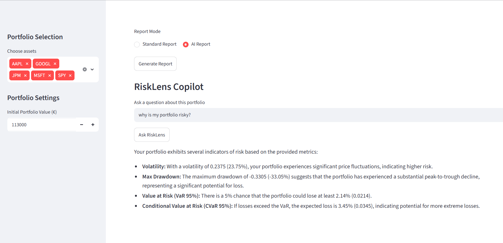
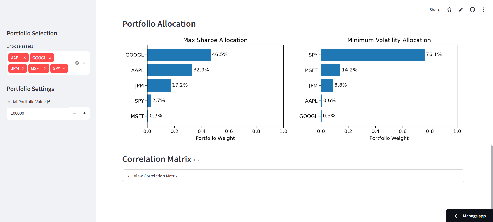

# 📈 RiskLens AI

> AI-Powered Financial Risk Intelligence Platform

RiskLens AI is an end-to-end financial risk analytics platform that combines quantitative risk modelling, portfolio optimisation, Monte Carlo simulation, stress testing, and Generative AI to provide institutional-style portfolio analysis.

Built with **FastAPI**, **PostgreSQL**, **Streamlit**, **Google Gemini**, and **Python**, the platform enables users to analyse investment portfolios, simulate future outcomes, optimise allocations, and generate executive-ready AI risk reports.

---

## 🌐 Live Demo

**Dashboard**

https://risklens-finance-ai.streamlit.app/

**API Documentation**

https://risklens-ai-production-efc5.up.railway.app/docs

---

# Dashboard Preview


### Portfolio Overview



### Stress Testing



### AI Executive Report



### Chat bot


### Portfolio Optimisation



---

# Features

## Portfolio Risk Analytics

✔ Annualised Volatility

✔ Sharpe Ratio

✔ Value at Risk (VaR)

✔ Conditional Value at Risk (CVaR)

✔ Maximum Drawdown

---

## Portfolio Optimisation

- Modern Portfolio Theory

- Efficient Frontier Simulation

- Maximum Sharpe Portfolio

- Minimum Volatility Portfolio

- Asset Allocation Visualisation

---

## Stress Testing

Interactive scenario analysis allows users to assign independent market shocks to each selected asset.

Example:

| Asset | Shock |
|--------|-------|
| AAPL | -15% |
| GOOGL | -30% |
| JPM | -5% |
| SPY | +2% |

The platform calculates:

- Portfolio loss

- Estimated monetary loss

- Stressed portfolio value

---

## Monte Carlo Simulation

Simulates thousands of future portfolio paths.

Outputs include:

- Expected Portfolio Value

- Median Outcome

- Worst 5%

- Best 5%

- Probability of Loss

---

## AI Executive Reporting

RiskLens AI integrates Google Gemini to generate professional executive summaries explaining:

- Portfolio risk profile

- Stress test results

- Optimisation recommendations

- Historical downside risk

---

## RiskLens Copilot

Built-in AI assistant capable of answering portfolio-specific questions such as:

> Why is my portfolio risky?

> How can I reduce volatility?

> What does the correlation matrix suggest?

---

# System Architecture

```text
                 Yahoo Finance
                        │
                        ▼
               Data Pipeline (ETL)
                        │
                        ▼
               PostgreSQL (Neon)
                        │
                        ▼
                 FastAPI Backend
                        │
        ┌───────────────┴───────────────┐
        ▼                               ▼
 Streamlit Dashboard            Google Gemini
        │                               │
        └───────────────┬───────────────┘
                        ▼
                  RiskLens AI
```

---

# Tech Stack

| Layer | Technology |
|---------|------------|
| Frontend | Streamlit |
| Backend | FastAPI |
| Database | PostgreSQL (Neon) |
| ORM | SQLAlchemy |
| AI | Google Gemini |
| Visualisation | Matplotlib |
| Finance | yfinance |
| Deployment | Railway + Streamlit Cloud |
| Language | Python |

---

# Project Structure

```text
risklens-ai/

backend/
    app/
        routes/
        services/
        models/

dashboard/

data_pipeline/

requirements.txt
```

---

# Installation

Clone the repository

```bash
git clone https://github.com/akindoluakinyemi/RiskLens-AI.git
```

Install dependencies

```bash
pip install -r requirements.txt
```

Create a `.env`

```env
DATABASE_URL=...
GEMINI_API_KEY=...
```

Run backend

```bash
uvicorn backend.app.main:app --reload
```

Run dashboard

```bash
streamlit run dashboard/app.py
```

---

# Future Improvements

- Authentication
- Portfolio persistence
- Historical portfolio tracking
- PDF report branding
- Additional optimisation algorithms
- Real-time market streaming
- News sentiment analysis
- ESG risk metrics

---

# Author

**Akindolu Akinyemi**

MSc Statistical Data Science — University College Dublin

LinkedIn: https://www.linkedin.com/in/akindolu-akinyemi-4857572b8/

GitHub: https://github.com/akindoluakinyemi

---

# License

MIT License